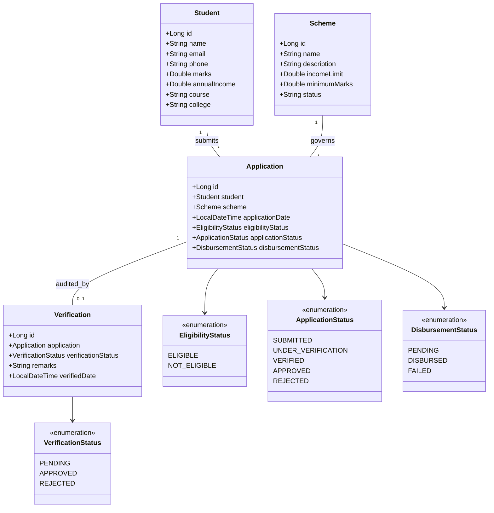
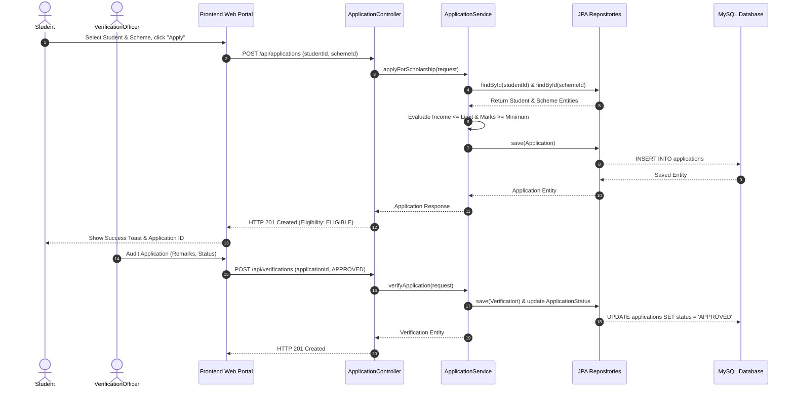

# ScholarTrack — System Documentation & Assessment Guide
**Regulation 2021 | Comprehensive Technical & Navigation Manual**

---

## Executive Summary
**ScholarTrack** is an enterprise-grade, Spring Boot-powered web application designed to solve the critical challenges of traditional scholarship allocation systems: manual verification delays, opaque approval workflows, and lack of real-time visibility for students and administrators. 

This document serves as the complete technical manual and evaluation guide structured around the **Rubrics For Assessment (Regulation 2021)**.

---

# Part 1: Web Application Navigation Guide

The ScholarTrack web portal is built as a responsive Single Page Application (SPA) using HTML5, modern CSS3 with glassmorphic cards, and Vanilla JavaScript with RESTful AJAX communication (`fetch` API).

### Navigation Overview & User Roles

| Navigation Tab | Primary Role | Description & Available Actions |
| :--- | :--- | :--- |
| **1. Dashboard Overview** | Admin / Examiner | Live metric cards (Total Students, Active Schemes, Applications, Eligible, Pending Verification, Approved) & Recent Applications table. |
| **2. Students** | Admin / Student | View registered student list, register new student profiles (Modal), edit details, and remove profiles. |
| **3. Schemes** | Admin | Create and manage scholarship schemes with criteria (Annual Income Cap, Minimum Marks %). |
| **4. Apply Scholarship** | Student / Officer | Submit scholarship applications with real-time automated eligibility evaluation. |
| **5. Verification** | Verification Officer | Review pending applications, examine student data against scheme rules, approve or reject with official remarks. |
| **6. Disbursement** | Finance / Admin | Update disbursement status (`PENDING`, `DISBURSED`, `FAILED`) for approved applications. |
| **7. Track Status** | Student / Examiner | Search application lifecycle by **Application ID** or **Student ID** with real-time visual progress timeline. |

---

### Step-by-Step Interactive Workflow

#### Step 1: Registering a Student Profile
1. Click **Students** on the left navigation sidebar.
2. Click the **"Add New Student"** button.
3. In the modal dialog, fill in:
   - Full Name (e.g., `Ananya Sharma`)
   - Email Address (e.g., `ananya.sharma@example.com`)
   - Phone Number (e.g., `9876543210`)
   - Academic Marks % (e.g., `88.5`)
   - Family Annual Income (e.g., `180000.00`)
   - Course Name (e.g., `B.Tech Computer Science`)
   - College Name (e.g., `National Institute of Technology`)
4. Click **"Save Student"**. A toast notification will confirm registration and display the generated `Student ID`.

#### Step 2: Creating a Scholarship Scheme
1. Click **Schemes** on the sidebar.
2. Click **"Add New Scheme"**.
3. Input scheme parameters:
   - Scheme Name (e.g., `Merit-Cum-Means Higher Education Grant`)
   - Description (e.g., `Financial support for meritorious underprivileged engineering students.`)
   - Maximum Annual Income Cap (e.g., `250000.00`)
   - Minimum Required Marks % (e.g., `75.00`)
4. Click **"Save Scheme"**.

#### Step 3: Submitting an Application & Real-time Automated Eligibility
1. Click **Apply Scholarship** on the sidebar.
2. Select the registered **Student** and **Scholarship Scheme** from the dropdown selectors.
3. Click **"Check Eligibility & Submit"**.
4. The system executes automated business logic:
   - If `Student Income <= Scheme Income Limit` AND `Student Marks >= Scheme Minimum Marks`, eligibility is marked **`ELIGIBLE`** and application status becomes **`SUBMITTED`**.
   - Otherwise, eligibility is marked **`NOT_ELIGIBLE`**.

#### Step 4: Verification Officer Audit
1. Click **Verification** on the sidebar.
2. Find the submitted application in the **Pending Verifications Table**.
3. Click **"Review / Audit"**.
4. Enter verification remarks (e.g., `Income certificate & marksheets verified authentic`) and select **`APPROVED`** or **`REJECTED`**.
5. Submit the audit. The application status updates to **`VERIFIED`** or **`REJECTED`**.

#### Step 5: Funds Disbursement
1. Click **Disbursement** on the sidebar.
2. View applications that have successfully passed officer verification.
3. Click **"Update Status"**, select **`DISBURSED`**, enter transaction reference ID, and submit.

#### Step 6: Status Tracking & Auditing
1. Click **Track Status** on the sidebar.
2. Enter the **Application ID** (e.g., `1`) or **Student ID** (e.g., `1`).
3. Click **"Track"** to view the timeline:
   - Student & Scheme Information
   - Automated Eligibility Result (`ELIGIBLE` / `NOT_ELIGIBLE`)
   - Officer Verification Status & Remarks
   - Disbursement Status

---

# Part 2: Assessment Criteria Detailed Breakdown

```
========================================================================================
                             RUBRICS FOR ASSESSMENT (REGULATION 2021)
========================================================================================
  1. Technical Implementation (Spring Boot Application Logic, REST APIs, CRUD, Integration)
  2. System Design & Architecture (UML Diagrams, Database Design, Layered Architecture)
  3. Code Quality & Efficiency (Coding Standards, Modularity, Global Error Handling)
  4. Presentation & Communication (Demo Walkthrough, Explanation, Examiner Q&A Guide)
========================================================================================
```

---

## Criterion 1: Technical Implementation

### 1.1 Technology Stack Specifications
- **Framework**: Spring Boot 3.2.5 (Java 21 LTS)
- **Data Access**: Spring Data JPA / Hibernate ORM
- **Database**: MySQL 8.0 / H2 Database (In-Memory fallback)
- **Validation**: Jakarta Bean Validation (`@NotNull`, `@NotBlank`, `@Min`, `@Max`, `@Email`)
- **Frontend**: HTML5, Vanilla JavaScript (ES6+ `fetch`), Custom CSS3 Design System

### 1.2 REST API Specification & Endpoint Registry

| Module | HTTP Method | Endpoint URI | Description | Request Payload / Params | Response Status |
| :--- | :--- | :--- | :--- | :--- | :--- |
| **Students** | `POST` | `/api/students` | Register student profile | `Student` JSON | `201 Created` |
| **Students** | `GET` | `/api/students` | Get all student profiles | None | `200 OK` |
| **Students** | `GET` | `/api/students/{id}` | Get student by ID | Path variable `id` | `200 OK` / `404` |
| **Students** | `PUT` | `/api/students/{id}` | Update student details | Path variable `id` + JSON | `200 OK` |
| **Students** | `DELETE` | `/api/students/{id}` | Delete student profile | Path variable `id` | `204 No Content` |
| **Schemes** | `POST` | `/api/schemes` | Create scholarship scheme | `Scheme` JSON | `201 Created` |
| **Schemes** | `GET` | `/api/schemes` | Get all active schemes | None | `200 OK` |
| **Schemes** | `GET` | `/api/schemes/{id}` | Get scheme details | Path variable `id` | `200 OK` |
| **Applications** | `POST` | `/api/applications` | Apply for scholarship | `ApplicationRequest` JSON | `201 Created` |
| **Applications** | `GET` | `/api/applications` | List all applications | None | `200 OK` |
| **Applications** | `GET` | `/api/applications/{id}` | Get application status | Path variable `id` | `200 OK` |
| **Applications** | `PUT` | `/api/applications/{id}/disbursement` | Update disbursement | `DisbursementUpdateRequest` | `200 OK` |
| **Verifications**| `POST` | `/api/verifications` | Officer verification audit| `VerificationRequest` JSON | `201 Created` |
| **Verifications**| `GET` | `/api/verifications` | Get all verifications | None | `200 OK` |

### 1.3 Spring Boot Application Logic Highlights

#### Real-time Automated Eligibility Assessment (`ApplicationService.java`)
```java
@Transactional
public Application applyForScholarship(ApplicationRequest request) {
    Student student = studentRepository.findById(request.getStudentId())
            .orElseThrow(() -> new ResourceNotFoundException("Student not found with ID: " + request.getStudentId()));

    Scheme scheme = schemeRepository.findById(request.getSchemeId())
            .orElseThrow(() -> new ResourceNotFoundException("Scheme not found with ID: " + request.getSchemeId()));

    // Business Logic: Eligibility Rule Evaluation
    boolean meetsIncome = student.getAnnualIncome() <= scheme.getIncomeLimit();
    boolean meetsMarks = student.getMarks() >= scheme.getMinimumMarks();

    EligibilityStatus eligibility = (meetsIncome && meetsMarks) 
            ? EligibilityStatus.ELIGIBLE 
            : EligibilityStatus.NOT_ELIGIBLE;

    Application application = new Application();
    application.setStudent(student);
    application.setScheme(scheme);
    application.setApplicationDate(LocalDateTime.now());
    application.setEligibilityStatus(eligibility);
    application.setApplicationStatus(eligibility == EligibilityStatus.ELIGIBLE 
            ? ApplicationStatus.SUBMITTED 
            : ApplicationStatus.REJECTED);
    application.setDisbursementStatus(DisbursementStatus.PENDING);

    return applicationRepository.save(application);
}
```

---

## Criterion 2: System Design & Architecture

### 2.1 Layered Architecture Pattern

```
+-----------------------------------------------------------------------+
|                         PRESENTATION LAYER                            |
|             Browser UI (index.html, style.css, app.js)                |
+-----------------------------------------------------------------------+
                                  | REST / HTTP JSON
+-----------------------------------------------------------------------+
|                         CONTROLLER LAYER                              |
|   StudentController, SchemeController, ApplicationController, etc.    |
+-----------------------------------------------------------------------+
                                  | DTOs / Method Invocation
+-----------------------------------------------------------------------+
|                       BUSINESS SERVICE LAYER                          |
|   StudentService, SchemeService, ApplicationService, VerificationService |
+-----------------------------------------------------------------------+
                                  | Java Entities / Repositories
+-----------------------------------------------------------------------+
|                        DATA ACCESS LAYER (JPA)                        |
|   StudentRepository, SchemeRepository, ApplicationRepository, etc.    |
+-----------------------------------------------------------------------+
                                  | SQL / JDBC
+-----------------------------------------------------------------------+
|                         DATABASE LAYER                                |
|                      MySQL DB / H2 In-Memory                          |
+-----------------------------------------------------------------------+
```

### 2.2 Relational Database Schema & Data Dictionary

#### SQL Relational Schema (`database/schema.sql`)
```sql
CREATE DATABASE IF NOT EXISTS scholartrack_db;
USE scholartrack_db;

CREATE TABLE students (
    id BIGINT AUTO_INCREMENT PRIMARY KEY,
    name VARCHAR(255) NOT NULL,
    email VARCHAR(255) NOT NULL UNIQUE,
    phone VARCHAR(50) NOT NULL,
    marks DOUBLE NOT NULL,
    annual_income DOUBLE NOT NULL,
    course VARCHAR(255) NOT NULL,
    college VARCHAR(255) NOT NULL
);

CREATE TABLE schemes (
    id BIGINT AUTO_INCREMENT PRIMARY KEY,
    name VARCHAR(255) NOT NULL,
    description TEXT NOT NULL,
    income_limit DOUBLE NOT NULL,
    minimum_marks DOUBLE NOT NULL,
    status VARCHAR(50) DEFAULT 'ACTIVE'
);

CREATE TABLE applications (
    id BIGINT AUTO_INCREMENT PRIMARY KEY,
    student_id BIGINT NOT NULL,
    scheme_id BIGINT NOT NULL,
    application_date DATETIME DEFAULT CURRENT_TIMESTAMP,
    eligibility_status VARCHAR(50) NOT NULL,
    application_status VARCHAR(50) NOT NULL,
    disbursement_status VARCHAR(50) NOT NULL,
    FOREIGN KEY (student_id) REFERENCES students(id) ON DELETE CASCADE,
    FOREIGN KEY (scheme_id) REFERENCES schemes(id) ON DELETE CASCADE
);

CREATE TABLE verifications (
    id BIGINT AUTO_INCREMENT PRIMARY KEY,
    application_id BIGINT NOT NULL,
    verification_status VARCHAR(50) NOT NULL,
    remarks TEXT,
    verified_date DATETIME DEFAULT CURRENT_TIMESTAMP,
    FOREIGN KEY (application_id) REFERENCES applications(id) ON DELETE CASCADE
);
```

---

### 2.3 UML Diagrams

#### UML Class Diagram


#### UML Sequence Diagram: End-to-End Application Workflow


---

## Criterion 3: Code Quality & Efficiency

### 3.1 Coding Standards & Clean Code Principles
- **Naming Conventions**: PascalCase for Classes (`StudentController`), camelCase for variables and methods (`applyForScholarship`), UPPER_CASE for Enums (`ELIGIBLE`).
- **SOLID Principles**:
  - **S (Single Responsibility)**: Separate controllers for routing, services for business logic, repositories for JPA queries.
  - **O (Open/Closed)**: Global Exception Handler accepts new exception classes without altering existing controller endpoints.
  - **D (Dependency Inversion)**: High-level controllers depend on Service interfaces/classes injected via Spring container `@Autowired` / Constructor Injection.

### 3.2 Modularity & Data Transfer Objects (DTO)
Entities are decoupled from API request/response structures using dedicated DTOs to prevent over-posting and shield database schema internals:
- `ApplicationRequest`: Encapsulates `studentId` and `schemeId`.
- `VerificationRequest`: Encapsulates `applicationId`, `verificationStatus`, and `remarks`.
- `DisbursementUpdateRequest`: Encapsulates `disbursementStatus`.
- `ErrorResponse`: Standardized JSON payload returned on API errors.

### 3.3 Centralized Global Exception & Error Handling

#### `GlobalExceptionHandler.java`
```java
@RestControllerAdvice
public class GlobalExceptionHandler {

    @ExceptionHandler(ResourceNotFoundException.class)
    public ResponseEntity<ErrorResponse> handleResourceNotFound(ResourceNotFoundException ex) {
        ErrorResponse error = new ErrorResponse(
                HttpStatus.NOT_FOUND.value(),
                ex.getMessage(),
                LocalDateTime.now()
        );
        return new ResponseEntity<>(error, HttpStatus.NOT_FOUND);
    }

    @ExceptionHandler(BusinessRuleException.class)
    public ResponseEntity<ErrorResponse> handleBusinessRule(BusinessRuleException ex) {
        ErrorResponse error = new ErrorResponse(
                HttpStatus.BAD_REQUEST.value(),
                ex.getMessage(),
                LocalDateTime.now()
        );
        return new ResponseEntity<>(error, HttpStatus.BAD_REQUEST);
    }

    @ExceptionHandler(MethodArgumentNotValidException.class)
    public ResponseEntity<ErrorResponse> handleValidationExceptions(MethodArgumentNotValidException ex) {
        String errorMessage = ex.getBindingResult().getFieldErrors().stream()
                .map(err -> err.getField() + ": " + err.getDefaultMessage())
                .collect(Collectors.joining(", "));
        
        ErrorResponse error = new ErrorResponse(
                HttpStatus.BAD_REQUEST.value(),
                errorMessage,
                LocalDateTime.now()
        );
        return new ResponseEntity<>(error, HttpStatus.BAD_REQUEST);
    }
}
```

---

## Criterion 4: Presentation & Communication

### 4.1 Examiner Live Demonstration Script (5-Minute Walkthrough)

1. **Opening & Problem Context (30 seconds)**:
   - *"Respected Examiners, I present **ScholarTrack**, an automated Spring Boot solution to streamline scholarship allocation, document verification, and status tracking."*
2. **Dashboard Overview (45 seconds)**:
   - Show the real-time Dashboard displaying live count cards (Total Students, Active Schemes, Pending Verifications, Approved Grants).
3. **Student & Scheme Registration (1 minute)**:
   - Register a student profile with GPA/Marks (85%) and Annual Income (Rs 1,80,000).
   - Show the active scholarship scheme parameters (Income limit: Rs 2,50,000, Minimum marks: 75%).
4. **Automated Eligibility Check & Application (1 minute)**:
   - Submit the scholarship application live. Highlight how the system automatically evaluates student metrics against scheme rules to assign `ELIGIBLE` status.
5. **Officer Audit & Disbursement Tracking (1 minute 15 seconds)**:
   - Switch to the Verification tab as an Officer, review the application, enter remarks, and mark `APPROVED`.
   - Update disbursement to `DISBURSED`.
   - Demonstrate the **Track Status** portal by searching Application ID `1` to render the full visual lifecycle log.

---

### 4.2 Top Examiner Viva Voce Questions & Technical Answers

#### Q1: How does your application evaluate eligibility automatically upon submission?
> **Answer**: When an application request containing `studentId` and `schemeId` is submitted to `/api/applications`, `ApplicationService` retrieves the `Student` and `Scheme` entities from JPA repositories. It evaluates `student.annualIncome <= scheme.incomeLimit` and `student.marks >= scheme.minimumMarks`. If both conditions are satisfied, `EligibilityStatus` is set to `ELIGIBLE` and `ApplicationStatus` becomes `SUBMITTED`. Otherwise, it is marked `NOT_ELIGIBLE` and `REJECTED`.

#### Q2: What architecture did you follow in Spring Boot and why?
> **Answer**: I implemented a classic **Layered Architecture**:
> 1. **Presentation Layer**: HTML5/CSS3/JavaScript single-page app calling REST endpoints via AJAX `fetch`.
> 2. **Controller Layer (`@RestController`)**: Handles HTTP requests, validation, and JSON serialization.
> 3. **Service Layer (`@Service`)**: Encapsulates transactional business logic and rules.
> 4. **Persistence Layer (`@Repository`)**: Spring Data JPA extending `JpaRepository` for database abstraction.
> 5. **Database Layer**: Relational MySQL database managed via JPA/Hibernate entities.

#### Q3: How do you handle exceptions across your REST APIs?
> **Answer**: I used `@RestControllerAdvice` in `GlobalExceptionHandler`. When custom exceptions such as `ResourceNotFoundException` or `BusinessRuleException` are thrown, Spring intercepts them and converts them into a uniform `ErrorResponse` JSON payload containing HTTP status code, error message, and timestamp.

#### Q4: Why did you use DTOs instead of passing Entity objects directly to REST endpoints?
> **Answer**: Using DTOs (`ApplicationRequest`, `VerificationRequest`) decouples the API contract from the database entities. This prevents mass assignment vulnerabilities, avoids circular reference issues in JSON serialization, and allows independent API evolution.

#### Q5: How is database consistency maintained during status updates?
> **Answer**: Service methods modifying database state are annotated with `@Transactional`. If any operation fails during execution (such as invalid application state transition), the entire transaction rolls back automatically.

---

## Project Repository & Execution Details
- **GitHub Repository**: [https://github.com/srinithir07/Scholarship_tracker.git](https://github.com/srinithir07/Scholarship_tracker.git)
- **Local Application Root**: `c:\Users\RAJENDRAN\.gemini\antigravity-ide\scratch\ScholarTrack`
- **Build Tool**: Apache Maven (`mvn clean install`)
- **Execution Command**: `mvn spring-boot:run`
- **Web App URL**: `http://localhost:8080/index.html`
